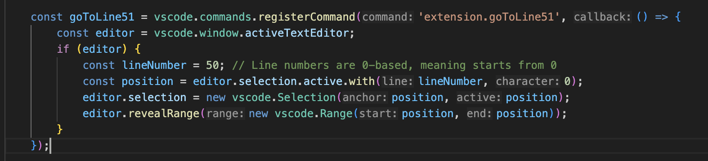
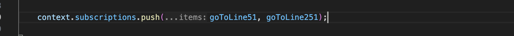
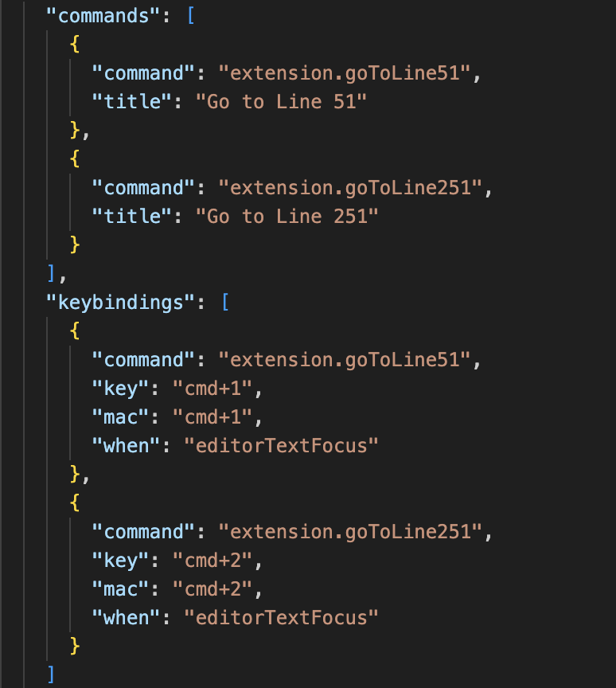
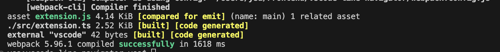
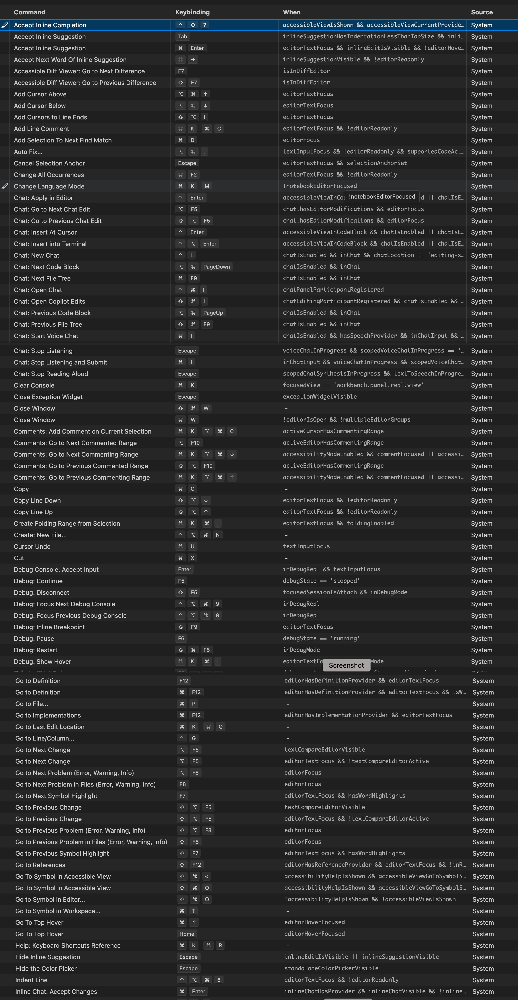

# vscode-line-navigator

Create your custom vscode command to naviagte to specific line number within your code.

Author: **Yogesh Salunke**

## Features

This is the vscode extension to create your custom vscode editor command to go to specific line number within your code. The main use case of this extension is when you have to go to specific line number within code multiple times.

You can create as many custom commads as you want.

For macos users there are two vscode commads already available, which off course can be adjusted / modified by Windows or Linux users based on their needs

1. **cmd+1:** This command will navigate you to the line number 51 within your code.
2. **cmd+2:** This command will navigate you to the line number 251 within your code.

## Extension Settings

You want to know how to add new custom command for line navaigation? Lets have small tour with following steps:

    First of all clone the repo and do`npm install` at root level (where package.json resides).

    For quick set up you can also watch the**video** available here:  https://www.youtube.com/watch?v=LirId-ID0To

1. Add the new function inside **src/extension.ts** file like below sample.

   
2. Add the newly created function inside subscription array in same file (extension.ts) :

   
3. Now, now its time to add the respective command and keybindings for the newly added function.

   * Go to package.json and add commmand and keybinding of your choice inside **contributes** object.See below example

     
4. Now its time to run the extension project to see any potential error. Run the project with command `npm run compile`
   and you should see the below output.

   
5. we have added the new command successfully,  now its time to test it. Please follow below steps to test newly added command

   1. Go to **View**-->**Run** or `cmd+shift+D` on macos, you will get the option on top left to run the extension, click on run "**Run Extension**"
   2. This will run the extension project and create new vscode instance with newly added command init. Now here, in newly created vscode instance, you can open any new project of your choice and test the newly added commands.

## Extensibility of this extension

The initial set up of this extension is created fullfill the  line navigation use case , but off course this extension can be extended to any other use case you want to handle.

Vscode Keyboard shortcuts for macOS can be found here: [keyboard shortcuts](https://code.visualstudio.com/shortcuts/keyboard-shortcuts-macos.pdf "Vscode Keyboard shortcuts for macOS")

Here are few sample vscode commands for which this extension can be extended.

